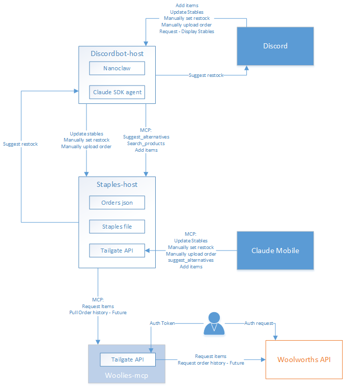
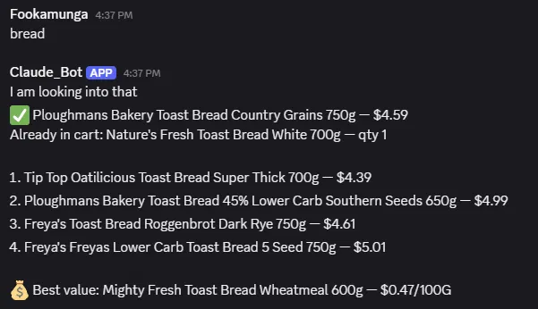
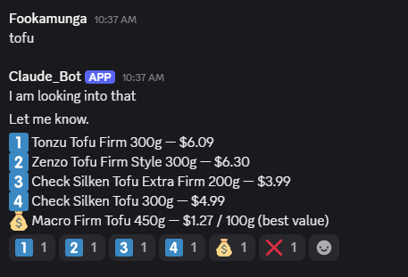

# Quartermaster

A household-ops system for Woolworths NZ shopping and staples tracking. Built
as a pair of MCP servers you can use directly from Claude mobile/desktop, with
an optional Discord bot on top for a chat-based front end.

*Discord and Claude Mobile are two interchangeable front ends onto the same
two backend servers — woolies-mcp and staples-host do the real work either
way.*

## Components

- **[woolies-mcp](https://github.com/adrian-baker/woolies-mcp)** — owns
  Woolworths NZ login, product search, and cart/order actions. External
  dependency, not built in this repo.
- **[staples-host](staples-host/)** — tracks your staples: what you buy, how
  often, restock rates, cheaper alternatives, best value across brands.

  `woolies-mcp` and `staples-host` are the required core, and both work
  standalone as Claude.ai custom connectors — no Discord needed.
- **[discordbot-host](discordbot-host/)** — an optional additional front end:
  a Discord-based way to talk to the same two servers. Nothing else in the
  system depends on it.

Each component you deploy needs its own `.env` file with real secrets (API
keys, tokens, the Discord webhook URL) before it'll run — see
[`staples-host/.env.example`](staples-host/.env.example) and
[`discordbot-host/.env.example`](discordbot-host/.env.example) for the
authoritative list of what each one needs.

## Setup order

Deploy and connect these in order:

1. **Deploy woolies-mcp first.** It's a hard prerequisite, not just a
   recommended order — staples-host depends on it being up and signed in to
   a Woolworths account before it can do anything useful at all.
2. **Add the woolies-mcp connector to Claude (mobile, desktop, or claude.ai)
   and use it directly** to confirm woolies-mcp itself is working correctly
   — signed in, returning real search results, able to write to the cart —
   before moving on to staples-host. This is a one-time verification step,
   not the intended long-term setup.
3. **Once staples-host is deployed, create and add the Quartermaster
   connector** in Claude.
4. **Disable or remove the woolies-mcp connector from Claude.** This step
   isn't optional. Having them both on will mean Quartermaster's
   feature set will not be used in chat. You can still add items etc but
   won't have recommended based on history or cheapest options.

   The Discord bot side of this is already structurally
   enforced in code — woolies-mcp is never registered as a tool source for
   any Discord-side agent session — but Claude's own connector list on
   claude.ai is account-level configuration outside this codebase, so it's
   on whoever sets this up to make sure only the Quartermaster connector
   stays active once Quartermaster is live.

## Managing staples

Fully conversational, no external doc or sync required — just talk to either
front end (Claude mobile/desktop or Discord):

- "Add bread as a staple"
- "Remove fish sauce"
- "Update oat milk's restock rate to every 10 days"

**Tip: name staples generically when brand/type doesn't matter, specifically
when it does.** "Bread" is fine if any bread counts. But if you regularly buy
two different Otis Oat Milk variants, track them as two separate staples
rather than one generic "oat milk" — each staple's purchase history and
restock rate are computed independently, so lumping different products
together blends their buying patterns into one misleading rate.

## Restock calculation and messages

Once a staple has enough purchase history (3+ purchases), its restock rate is
learned automatically: the median days-per-unit between purchases, scaled by
how much you bought last time — a bigger last purchase means more runway
before the next nudge. A manual rate (set directly, e.g. "every 10 days") is
quantity-blind by design, and is never silently overwritten by the learned
calculation even once enough history exists to compute one.

Every Sunday at 5pm NZ time, staples-host checks every staple's restock rate
and posts straight to Discord (via a webhook) listing anything projected to
run out within the next 7 days — it always posts, including a "nothing due
this week" message when the list is empty, so a quiet week reads as
confirmed-empty rather than a silently broken check.

**Known limitation:** this proactive weekly nudge only works via Discord.
There's no mechanism for an MCP server to push a message into an idle Claude
mobile/desktop conversation, so a webhook is the only delivery path for now —
not a bug, just something Claude mobile/desktop can't currently do.

The on-demand alternative works from either front end: ask "what needs
restocking" anytime (Discord or Claude mobile) to get the same 7-day-runway
list on demand, using the exact same calculation as the weekly push.

## Suggestions and purchase history

When you ask for something like "add cheese," the recommendation depends on
what's known about it. If you've bought it before, it recommends whichever
option you buy most often, marks it ✅, and separately notes anything already
in your cart:

If you haven't, it bases alternatives on anything related already in your
cart, or falls back to a general search if not — just a plain numbered list,
nothing marked, since there's no real signal to recommend one over another:

Either way, asking about one item always includes a best-value pick — the
cheapest price-per-unit option of that type — regardless of which path found
the recommendation. See "Recipe pricing" below for why a whole recipe/
ingredient list at once doesn't get the same treatment.

The assistant always resolves a request like this through staples-host's own
ranking/best-value tool rather than a raw Woolworths product search — this is
deliberate, not just an implementation detail: a plain search has no idea
what your household actually buys, so it can't rank anything or tell you
whether it's a good price. Asking to "search products" or "browse" won't
skip this — there's no separate path that would give you a worse, unranked
answer.

These suggestions are only as good as your purchase history, so recording it
matters. Until Woolworths fixes their order-history API (at which point this
becomes automatic), that's manual: copy the whole order — including its date
and order/invoice number — from the Orders page on the Woolworths website,
and paste it into either the `#order-import` Discord channel or a Claude.ai
conversation with the staples-host connector. That paste becomes real
purchase history, which is exactly what the recommendations above draw on.

## Recipe pricing

Asking about a single item (e.g. "add cheese") always includes a best-value
pick alongside its alternatives — the cheapest price-per-unit option in that
product's variety, across any brand.

Asking for a whole recipe or ingredient list at once (e.g. "what do I need
for chilli lime squid salad") does **not** get a best-value pick for each
ingredient. Computing it means an extra product-variety search per
ingredient on top of resolving the ingredient itself, and a multi-ingredient
request already has to resolve everything in one call within the underlying
API's own response-time limit — adding a best-value search per ingredient
pushed a realistic recipe well past that limit and produced no reply at all,
not just a slower one. So recipe/list requests skip best-value entirely and
return alternatives only.

If you want the cheapest option for one ingredient from a recipe, ask about
that ingredient on its own afterwards (e.g. "what's the best value cheese")
and it'll get the full single-item treatment, best-value included.

## More detail

- [CLAUDE.md](CLAUDE.md) — full build spec and architecture.
- [DEPLOYMENT.md](DEPLOYMENT.md) — NAS/environment details.
